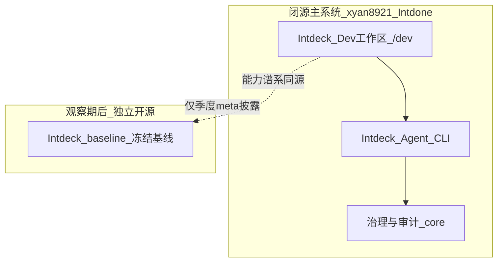

# Intdeck（Dev 端）非技术说明书 v1

> **版本**：v1.0  
> **最后更新**：2026-05  
> **读者**：独立开发者、接单交付负责人、个人商业项目负责人、需要验收证据的非技术甲方  
> **定位**：白皮书 × 产品说明书——用「能力语言」说明能做什么、如何留证、如何验收；技术命令集中在附录。  
> **边界**：本文描述 **Intdone 主系统内的 Dev 研发工作区（Intdeck）** 与 **Intdeck Agent**；**不是** C/B 终端用户产品通路。

---

## 1. 阅读指南

### 1.1 谁该读

| 角色 | 建议阅读章节 |
|------|----------------|
| 项目负责人 / 甲方验收 | §2、§5–§7、§9、附录 B |
| 独立开发者 / 全栈一人公司 | 全文；重点 §4、§6、§8、附录 A |
| 法务 / 合规（轻量） | §5、§10 |

### 1.2 读完能做什么决策

- 是否用 **一条命令** 生成可交付的 **证据包**，以及应附带哪些文件给对方。
- 如何在里程碑节点做 **门禁自检** 与 **只读回放**，证明「当时的行为可复核」。
- 与 **未来开源 baseline** 的关系：何时需要关注季度披露，而无需理解实现细节。

### 1.3 与 C/B 产品手册的边界

- **C/B 端**：面向终端用户与业务场景的产品能力（本说明书不覆盖操作步骤）。
- **Dev 端（Intdeck）**：内部研发、治理试验、证据与审计；默认 **生产构建可关闭** `/dev` 入口（见 §8）。

---

## 2. 一句话与定位

**Intdeck** = Intdone 内的 **Dev 研发工作区** + **Intdeck Agent（CLI）治理基座**。

- 帮你把「做过什么、是否通过门禁、能否复核」变成 **可归档的文件**，而不是口头承诺。
- **不是** 面向消费者的 App 功能说明；成熟能力经隐藏链路回流 C/B，但验收 Dev 证据包不等于验收整站产品。

---

## 3. 关系图（非技术）



要点（详见 `INTDONE_INTDECK_BASELINE_AND_REPO_BOUNDARY_v1.md`）：

- **两套实体**：商业主系统 vs 未来 baseline 开源仓。
- **代码断交**：baseline 实现不回流主系统；主系统不对 baseline 做日常路线图管理。
- **季度 meta 对齐**：只披露威胁模型、schema、红队摘要、依赖风险等 **元信息**，不构成互相管理。

---

## 4. Intdeck Agent 基座能做什么（五维叙事）

### 4.1 企业级门禁

在发版或交付前，可运行 **lint / 测试 / 红队最小集**，结果汇总为 `gates.summary.json`。  
**通过标准**：`overallPassed` 为真（详见 §9）。

### 4.2 分阶段里程碑与证据归档

命令 **`all`** 依次：执行可审计动作 → 导出经验包 → 跑门禁 → 生成 **证据包清单与指纹**（`evidence.manifest.json` + 人读 `evidence.summary.md`）。

### 4.3 审计与链路追溯

每条关键动作可关联 **G0 报告**、Experience 条目与 **correlation**；导出包支持离线查看与第三方复核。

### 4.4 全流程留痕与防篡改

证据包对关键文件计算 **SHA-256** 并写入 manifest；含仓库 commit、运行时与配置指纹，便于事后核对「文件未被替换」。

### 4.5 可轻可重

- 可只跑 `gates` 做交付前自检。
- 可只 `export` 不跑完整 `all`。
- **回放为只读**：不重复执行有副作用的操作，仅验证策略与快照是否一致。

---

## 5. 原生伦理框架（白话）

Intdone 在 `ETHICS.md` 中约定 **E1–E5**（透明、可控、可问责、包容、可持续等原则，此处不展开条文）。

**G0 强制治理壳**（与架构设计一致）：

- **先拦再跑**：不满足治理条件的动作不进入默认执行路径。
- **可阻断、可审计**：失败会留下报告与原因，而非静默跳过。
- **证据优先**：对外说明「做过门禁」时，应附带机器可读摘要，而非截图 alone。

---

## 6. 工程能力（非技术表述）

| 能力块 | 你能得到什么 | 深链 |
|--------|----------------|------|
| **门禁** | 本次构建/交付是否通过质量与安全最小集 | `gates.summary.json`；§9 |
| **证据包** | 一次归档的「目录页 + 指纹 + 人读摘要」 | `docs/INTDECK_AGENT_EVIDENCE_PACK_v1.md` |
| **回放** | 证明历史经验包仍可按策略复核；失败会标明阶段 | `replay.summary.md` |
| **能力声明与漂移** | 导出包内记录 Agent 配置指纹，便于发现「换配置后结果不可比」 | `experience.export.json` manifest |

威胁与存储边界（摘要）：见 `INTDONE_INTDECK_EXPERIENCE_STORAGE_AND_THREAT_MODEL_v1.md` 与威胁模型白皮书 v0。

---

## 7. 用户使用场景

### 场景 A：自研 SaaS 长期迭代

**一条命令**：

```bash
npm run intdeck:agent -- all --outDir=out/intdeck-agent-cli
```

**建议留存/归档**：

| 文件 | 用途 |
|------|------|
| `evidence.summary.md` | 给未来的自己或协作者快速读懂 |
| `evidence.manifest.json` | 指纹与清单（防篡改） |
| `gates.summary.json` | 门禁是否通过 |
| `g0-reports.json` | 审计动作明细 |
| `experience.export.json` | 经验包（后续回放输入） |

### 场景 B：接单里程碑交付

里程碑截止日执行 `all`，将 **`evidence.summary.md` + `gates.summary.json` + `evidence.manifest.json`** 打包给对方（ZIP 即可）。

可选：对方若要求「可复核」，再提供同目录下 `replay.summary.md`（见场景 C 第二步）。

### 场景 C：发版前自检留证

```bash
npm run intdeck:agent -- gates --outDir=out/intdeck-agent-cli
```

确认 `overallPassed=true` 后再发版；重大版本可再跑 `all` 做完整归档。

**回放验证（第二步）**：

```bash
npm run intdeck:agent -- replay --last=1 --outDir=out/intdeck-agent-cli
# 或指定历史导出包：
npm run intdeck:agent -- replay --from=out/intdeck-agent-cli/experience.export.json --last=1 --outDir=out/intdeck-agent-cli
```

交付附加：`replay.summary.md`（无 regression / 阻断原因一目了然）。

---

## 8. Dev 工作区（浏览器）

- **入口**：部署启用时访问 `/dev`（开发环境默认开启）。
- **与 CLI 关系**：浏览器适合试验与观测；**可交付证据包** 以 CLI 产物为准（路径一致：`out/intdeck-agent-cli/`）。
- **生产关闭 Dev**：构建时设置 `VITE_ENABLE_DEV_WORKSPACE=false`（或项目约定变量），避免终端用户进入内部工作区。详见 `DEPLOYMENT.md`。

---

## 9. 交付与验收检查单（可直接给甲方）

- [ ] 已提供 **`evidence.summary.md`**（人读）与 **`evidence.manifest.json`**（指纹）
- [ ] **`gates.summary.json`** 中 `overallPassed` 为 **true**（若声明已通过门禁）
- [ ] **`g0-reports.json`** 与 **`experience.export.json`** 同包交付（可追溯）
- [ ] 若声明可回放：已提供 **`replay.summary.md`**，且无未解释的 **blocked / regression**
- [ ] manifest 中 **commit / configSha256** 与说明一致（未在验收后替换文件）

---

## 10. 安全与默认策略

- **本地优先**：默认在开发者机器运行；证据落在本地 `out/`（已 gitignore）。
- **出站声明**：Agent 配置层默认 **`networkEgress=deny`**（声明能力，非网络防火墙本身）。
- **Docker 离线可选**：可用无网络容器形态跑同一 CLI（见 `DEPLOYMENT.md`「Intdeck Agent · R1-a / R1-c」）。
- **不包含**：默认不提供「任意下载并执行远程插件」类能力；若未来引入须升级威胁模型与红队门禁。

---

## 11. 附录

### 附录 A · 术语表

| 术语 | 含义 |
|------|------|
| G0 | 治理壳下的可审计动作报告 |
| Experience | 可导出、可回放的经验条目集合 |
| Evidence Pack | 一次 `all`（或等效流程）产出的证据文件组合 |
| baseline | 从 Dev 能力谱系导出的 **冻结开源子集**（独立仓，观察期后） |
| meta 披露 | 季度安全/契约信息对齐，**不是**代码合并 |

### 附录 B · 命令速查

| 目的 | 命令 |
|------|------|
| 完整证据包 | `npm run intdeck:agent -- all --outDir=out/intdeck-agent-cli` |
| 仅门禁 | `npm run intdeck:agent -- gates --outDir=out/intdeck-agent-cli` |
| 仅导出 | `npm run intdeck:agent -- export --outDir=out/intdeck-agent-cli` |
| 回放最近 N 条 | `npm run intdeck:agent -- replay --last=1 --outDir=out/intdeck-agent-cli` |
| 指定导出包回放 | `npm run intdeck:agent -- replay --from=<path>/experience.export.json --last=1 --outDir=out/intdeck-agent-cli` |
| baseline 导出预览 | `npm run export:intdeck-baseline -- --dry-run` |

### 附录 C · 产物文件表

| 文件 | 读者 |
|------|------|
| `evidence.summary.md` | 人 |
| `evidence.manifest.json` | 机器 / 指纹 |
| `gates.summary.json` | 机器 |
| `experience.export.json` | 机器 / 回放输入 |
| `g0-reports.json` | 机器 / 审计 |
| `replay.results.json` | 机器 |
| `replay.summary.md` | 人 |

### 附录 D · 常见问题

**Q：replay 提示找不到 experience？**  
A：先运行 `export` 或 `all`，或使用 `--from=` 指向已有的 `experience.export.json`。

**Q：`gates` 失败怎么办？**  
A：打开 `gates.summary.json` 查看失败项的 `errorSummary`；修复后重新 `gates` 或 `all`。

**Q：证据包可以只给 summary 吗？**  
A：对外建议 **summary + manifest** 至少成对；严肃验收应含 `gates` 与 G0/Experience 原始 JSON。

---

## 12. 分仓复刻说明（meta 章）

| 章节 | baseline 独立仓建议 |
|------|---------------------|
| §1–§7、§9–§11 | 可 **verbatim** 复制，替换 §12 与文首仓库 URL |
| §3 关系图 | 将「未来」改为「本仓库」；更新维护者联系 |
| §8 | 删除或改为「baseline 无 /dev UI」 |
| 链接 | `xyan8921/Intdone` → baseline 仓库地址；保留相对 `docs/` 技术深链 |

主仓抓取清单：`docs/INTDECK_BASELINE_FETCH_MANIFEST_DRAFT_v1.md`。

---

## 修订记录

| 日期 | 版本 | 说明 |
|------|------|------|
| 2026-05 | v1.0 | B3 交付：非技术向全量说明书 |
